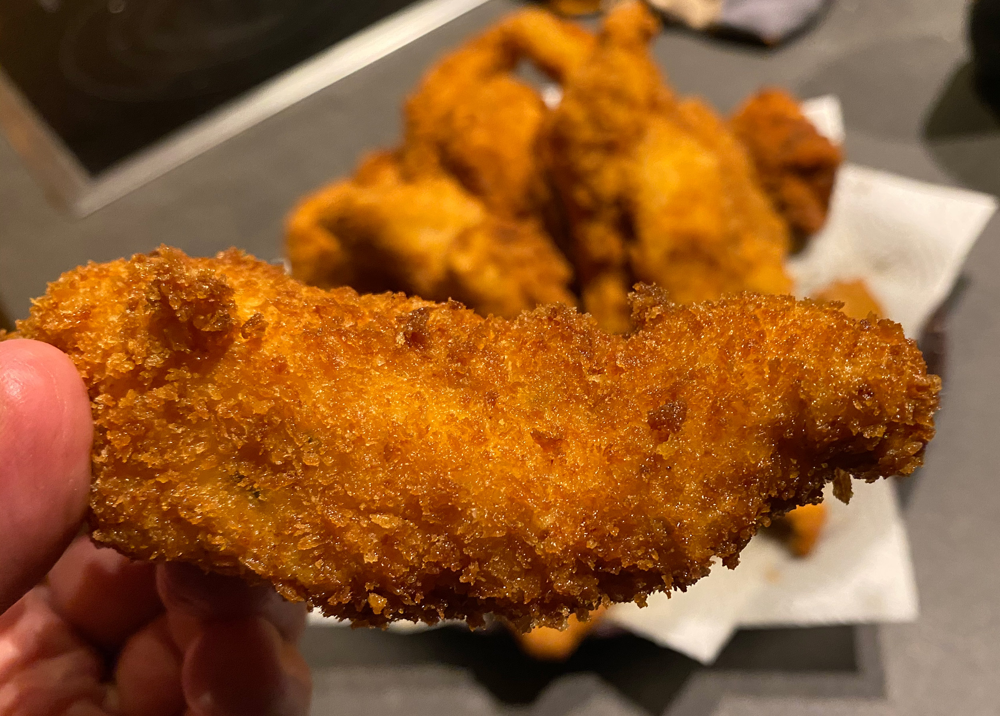

## Chicken Strips

Everyone loves a good tendie.

### The key

Deliciousness is a result of these 4 factors multiplying with each other:

1. Marinating for at least 30 min in a salty, spice-laden buttermilk mixture. 
2. Panko bread crumbs. They absorb less oil, get crunchier. 
3. A thick exterior as they are double dredged in flour, egg and then again in panko.
4. Letting the breading hydrate for 15-30 min, so it doesn't fall off during frying. 

### Ingredients 

* A liter of cooking oil. You can save, jar and reuse afterwards.
* 4 Chicken Breasts
* 2 cup flour
* 2 cups panko bread crumbs
* 2 eggs

Marinade:

Feel free to get creative on the spice mixture. Doesn't matter if you substitute a spice out. I normally just use yogurt. 

* 1 cup buttermilk or plain yogurt
* 1-2 tsp salt
* 1 tsp onion powder
* 1 tsp garlic powder
* 1 tsp smoked or normal paprika 
* 1 tsp italian seasoning or oregano 
* Pepper
* optional 1/2 tsp cayenne or chipotle powder

### Prep

Cut the chicken breasts into 3-5 strips per breasts. Heterogeneous sizing is fine, but keep in mind if it gets too chunky, it'll take a bit longer to cook through.

Mix up the marinade in a Tupperware or bowl big enough to fit your chicken. You'll want the marinade to taste just a bit too salty, almost all the flavor is here. Coat the chicken pieces well and then cover it and let it sit out for 30 min, or refrigerate until use (up to the next day). 

Beat the 2 eggs in a bowl with a couple tablespoons of water. 

Put the 2 cups of flour and the 2 cups of panko each in their own bowl and feel free to give them a pinch of salt (but not too much, as the marinade has plenty).

Using the "dry hand / wet hand" technique, take each piece of wet chicken and press it into the flour. Then shake off excess flour, and douse it in the egg. Make sure it's fully covered in egg, let the excess drip off and press into the panko. You can really press each piece on two sides into the panko, making sure no wetness is visible anymore. Then put on a rack to dry.

Ideally the chicken sits and the breading hydrates for 30 min. Be impatient at your own risk.

### Cook 

You are going to fry these in a pot of some kind. Hopefully not too wide, or else you'll need a ton of oil. Hopefully tall enough to avoid too much splattering.

Cooking is extremely quick. It should really only take 3-5 minutes for them to cook. Make sure the oil is hot enough by putting some flour or batter in the oil and seeing it bubble and foam.

### Serve 

I like to make a small amount of homemade BBQ sauce. It's very quick, just bring the following to a simmer and you are done:

* 1/3 cup ketchup
* 2 tablespoons apple cider vinegar
* 1 tablespoon honey
* 1 tsp worcestershire sauce
* Pinch / half tsp of onion and garlic powder
* Pinch of smoked paprika 
* Couple drops of liquid smoke if you want to get real

