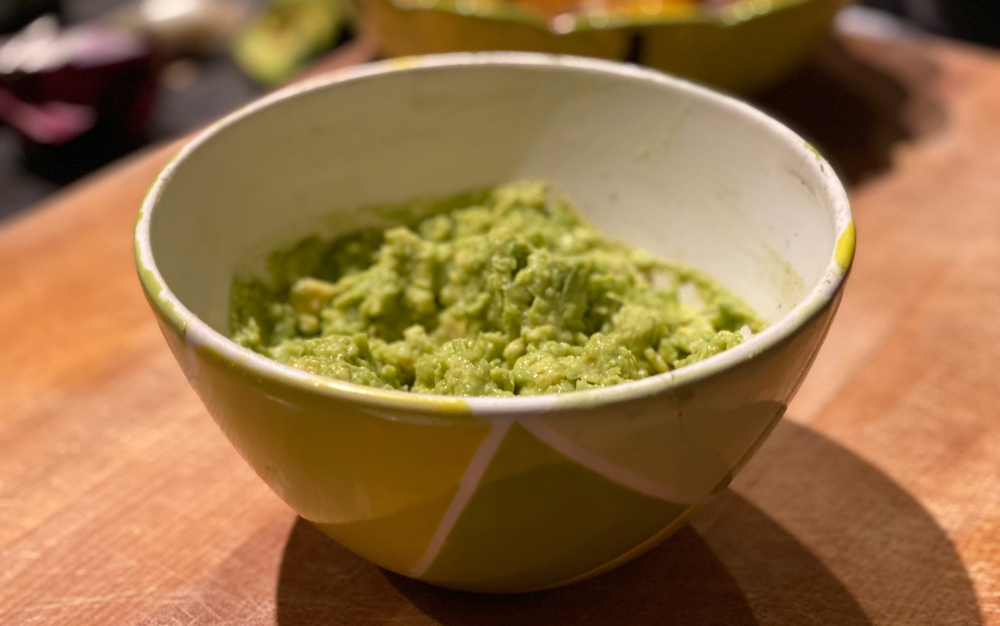

## Guacamole

### The key

The first rule of guacamole is lime and salt. The second rule of guacamole is lime and salt.

Taste multiple times after it's made to make sure you have enough of both.

### Ingredients

* 4 avocados
* Lime
* Salt

Optionally you can make [Pico de Gallo](pico) and mix in a couple tablespoons or add in onions/garlic/cilantro if you must :)

### Prep

1. Cut the avocados lengthwise around the pit.
2. Remove pit by holding the avocado in your hand and giving it a tap with a big knife and then twisting. Be careful!
3. Scoop out avocado innards. If it's not ripe enough to scoop like ice cream, you can score the avocado in a grid like pattern with a knife before.
4. Salt
5. Lime
6. Salt and Lime
7. If some of your avocados were not ripe, you can mix things around, press down into the bowl and cover and let sit. This will soften the harder bits and make it easier to mash.
8. Mash the avocado with a fork.
9. Lime? Salt?

