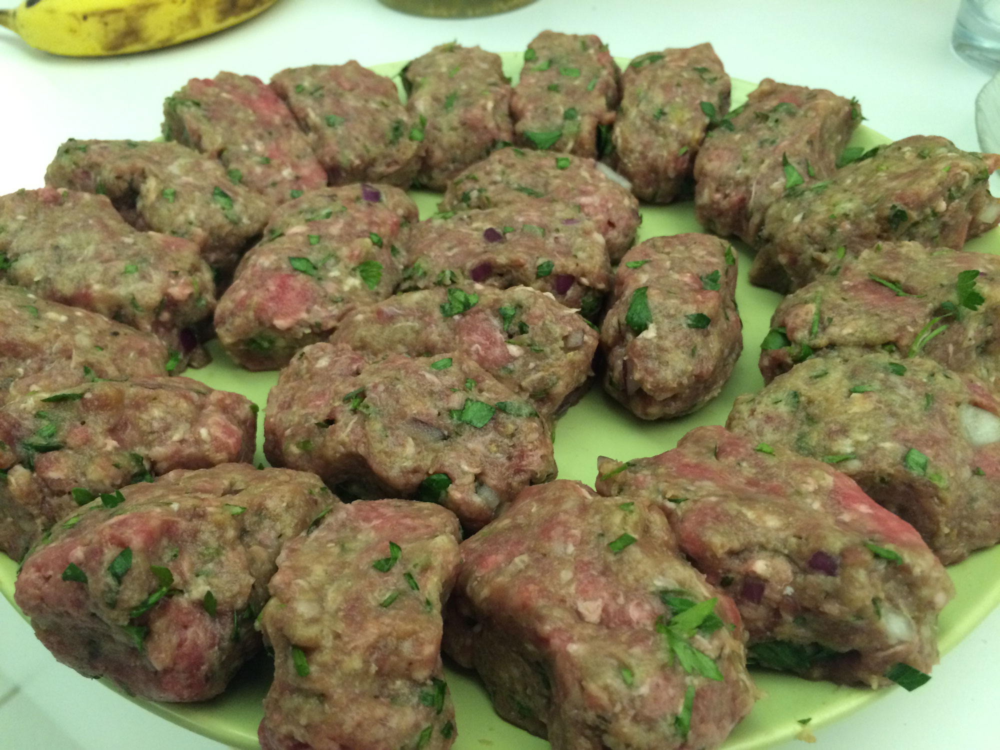

## Köfte

The key to good Köfte is that they are well seasoned, the right amount of moisture and well browned.

In terms of moisture, it's a matter of putting in enough dry ingredients such as flour or breadcrumbs to counter the wet onion. This may shock the North Americans, but I typically taste the raw meat mixture to ensure it's salty enough before I begin cooking. While cooking, don't be afraid to get good color on them.

### Ingredients

* ~500g/1 pound ground beef. Can do 50% ground lamb if you wanna go pro.
* 1 finely grated onion (or food processored)
* 1 egg
* 1 tablespoon flour
* salt to taste,  maybe 2 tsp?

Optional ingredients, sometimes I do some, sometimes all:

* 2 tsp cumin
* 2 tablespoons sumak
* 1/4 cup finely chopped flat parsley or mint (I always have something green, mint is great when there's lamb in there)
* 1/2-3/4 cup breadcrumbs (makes them a bit less "meat"-y and you end up with more kofte)
* Cayenne if you want them a bit spicy
* 1-2 tablespoon brown sugar if you want them a bit sweet (good when they are mint-y)

### Prep

I do flat köfte vs. round balls because they cook more evenly. Think little mini burger patties. If they are flat you can cook one side, flip them when the bottom is brown, cook the other side and you are done. If they are rounded you have to roll them around the pan like meatballs and it's hard to get them browned.

### Cook

Cover bottom of a pan in a mix 50/50 of olive oil and and oil with a higher smoke point like veggie oil / rapeseed oil. It's probably going to be 1/2 cup oil at least to make sure the whole pan bottom is covered. Better to do all olive than all veggie oil if you don't have both.

I do med-high heat, wait for the oil to heat up, then cook in batches. Putting too many in at once lowers the temperature of the oil, so I give them a bit of space and maximum will do 10 at a time. On a normal size cooking pan, 1 pound of meat probably means 2 batches.

Only need a couple min on each side. should be brown like in the pic. If they are burning in a couple min, turn down heat. First batch always cooks slower....